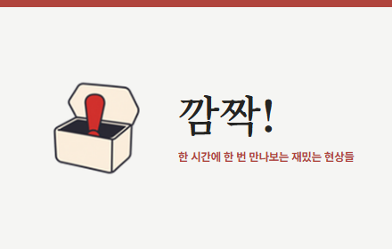
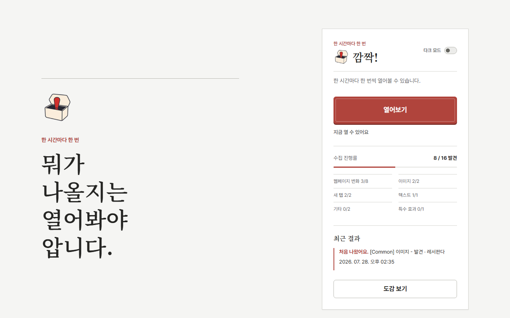
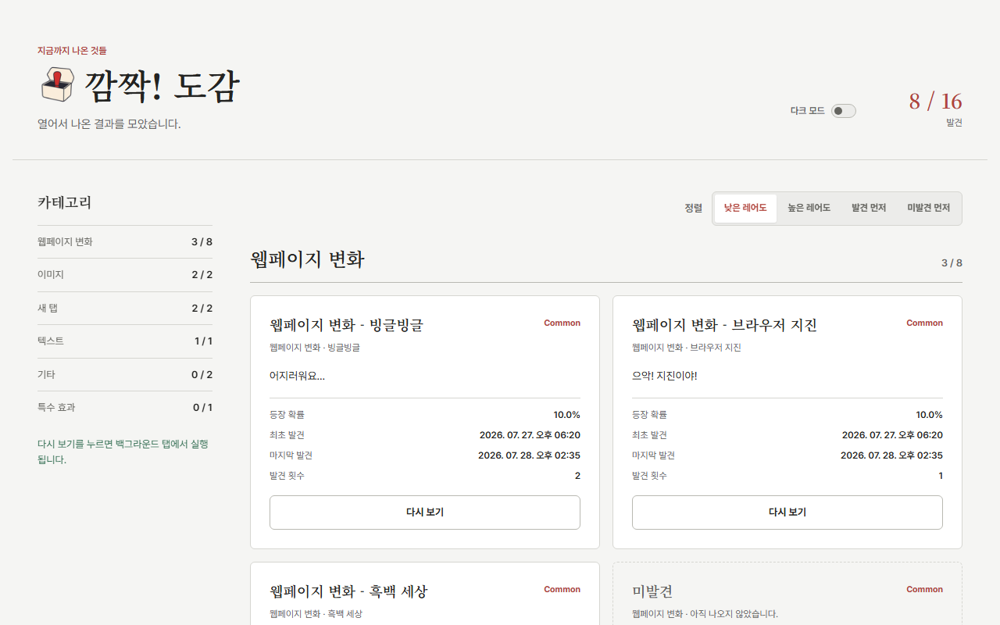
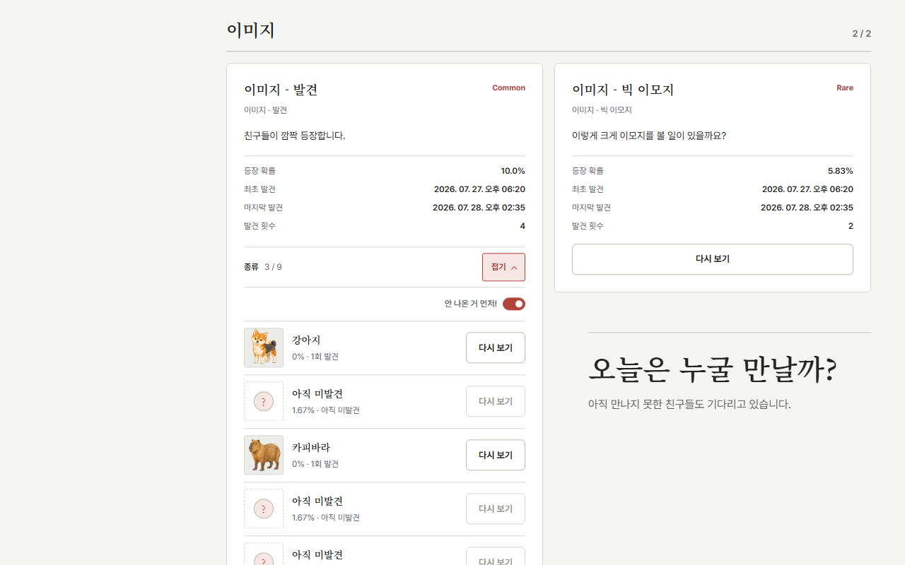
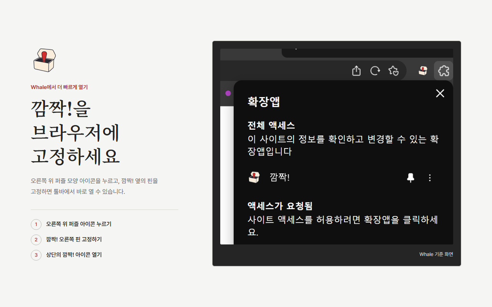

# 깜짝!

**한 시간에 한 번, 뭐가 나올지 모르는 버튼을 눌러보세요.**

`깜짝!`은 인터넷을 둘러보다가 한 시간마다 한 번 눌러볼 수 있는 랜덤 버튼입니다. 화면에 눈이 내리거나 동물 친구가 나타나고, 잠깐 랜선 여행을 떠날 수도 있습니다. 가끔은 정말 아무 일도 일어나지 않습니다.

  

  

## 주요 기능

- 한 시간마다 한 번 누를 수 있는 랜덤 버튼
- Common부터 Mythic까지 다섯 가지 등급으로 나뉜 16개 현상
- 웹페이지 변화, 친구 발견, 랜선 여행, 오늘의 TMI 등 다양한 결과
- 나온 현상과 세부 종류를 기록하고 정렬할 수 있는 도감
- 발견한 현상은 쿨타임 없이 다시 보기
- 광고, 분석 도구, 외부 데이터 전송 없이 브라우저 안에서만 동작

## 화면 미리보기

| 한 시간마다 한 번 | 지금까지 나온 것들 |
| --- | --- |
|  |  |
| **오늘은 누굴 만날까?** | **잠깐 떠나는 랜선 여행** |
|  |  |

## 처음 사용하기

설치한 뒤 브라우저 상단의 확장 프로그램 메뉴를 열고 `깜짝!`을 고정해두면 언제든 바로 열 수 있습니다. 아래 이미지는 Whale 기준이며 Chrome에서도 확장 프로그램 메뉴에서 같은 방식으로 고정할 수 있습니다.

1. Whale 오른쪽 위의 퍼즐 모양 아이콘을 누릅니다.
2. `깜짝!` 오른쪽에 있는 핀을 눌러 고정합니다.
3. 브라우저 상단에 나타난 `깜짝!` 아이콘을 눌러 상자를 엽니다.

나온 결과는 도감에 자동으로 기록됩니다. 버튼은 한 시간 뒤에 다시 누를 수 있고, 발견한 현상은 도감에서 언제든 다시 볼 수 있습니다.

## 데이터와 개인정보

발견 기록과 설정은 사용자의 브라우저 안에만 저장됩니다. 광고, 분석 도구와 외부 데이터 전송은 사용하지 않습니다. 자세한 내용은 [개인정보 처리방침](PRIVACY.md)에서 확인할 수 있습니다.

## 개발

이 프로젝트는 별도의 빌드 과정이 없는 순수 HTML, CSS, JavaScript 기반 Manifest V3 확장 프로그램입니다. 로컬 설치, 테스트, 패키징과 구조 설명은 [개발 문서](docs/DEVELOPMENT.md)에 정리되어 있습니다.

## 라이선스

이 프로젝트는 [MIT License](LICENSE)로 배포됩니다.
